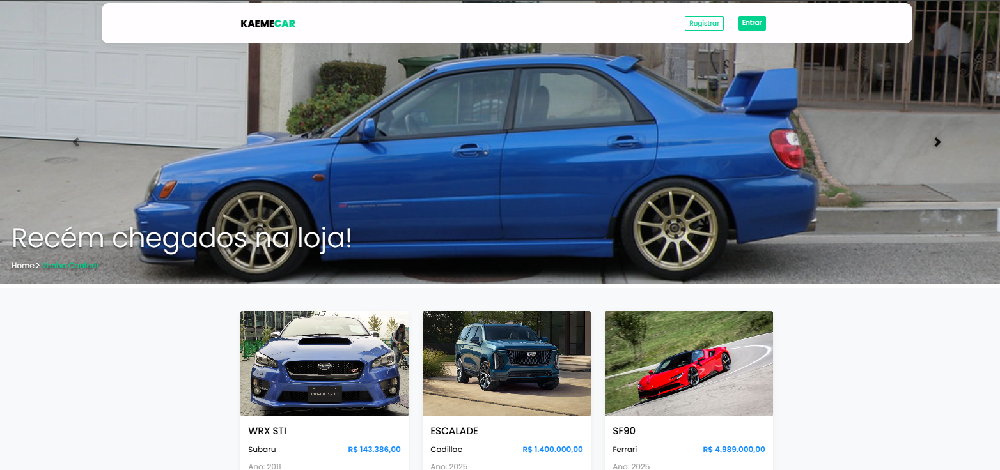
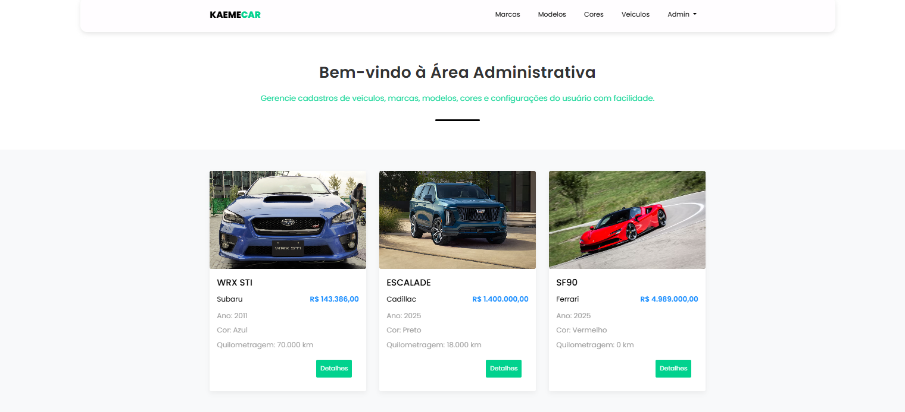
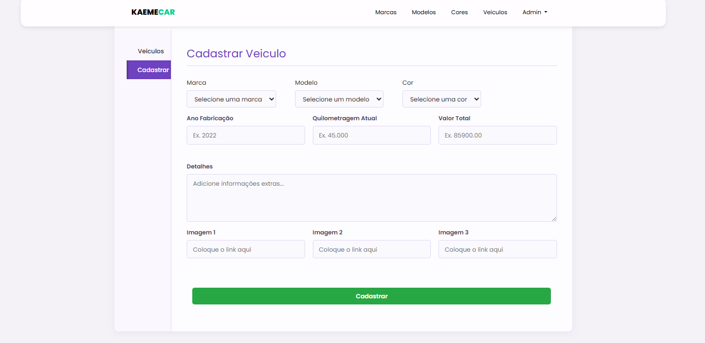
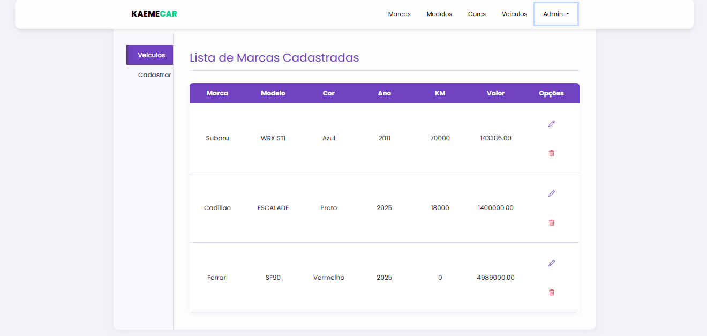
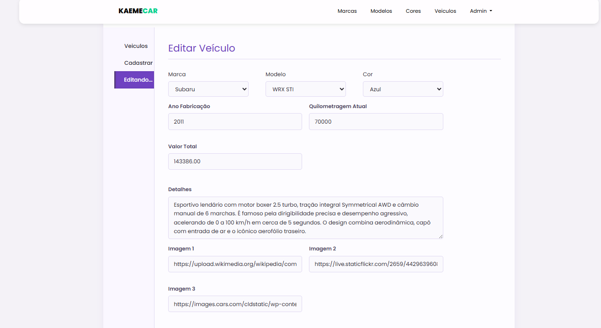
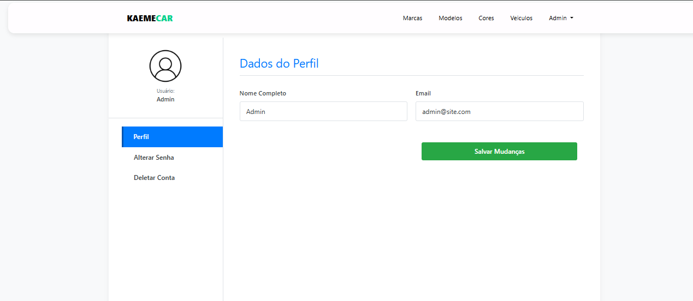
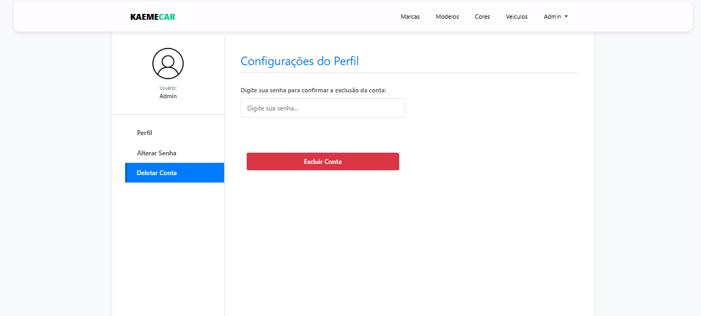

# 🚗 Venda-de-Carros
Trabalho de **LPWEB II - Sistema de Venda de Veículos (Laravel)**

---

## ⚙️ Passo a passo para execução

### 1️⃣ Clonar o repositório
```bash
git clone https://github.com/JeanCampos03/Venda-de-Carros
cd Venda-de-Carros
```

### 2️⃣ Instalar as dependências
```bash
composer install
```
Se aparecer erro dizendo que o Composer não é reconhecido, instale-o em:
https://getcomposer.org/download/


### 3️⃣ Criar o arquivo .env (se não existir)
Renomear arquivo ".env.example"
```bash
mv .env.example .env
```

### 4️⃣ Configurar o banco de dados (dentro do arquivo .env)
DB_CONNECTION=mysql
DB_HOST=127.0.0.1
DB_PORT=3306
DB_DATABASE=venda_carro
DB_USERNAME=root
DB_PASSWORD=

---

### 5️⃣ Gerar a chave da aplicação 
```bash
php artisan key:generate
```
---

### 6️⃣ Subir as migrations
```bash
php artisan migrate --seed
```
- Cria todas as tabelas;
- Insere o usuário padrão automaticamente

Cria user automaticamente:
email : admin@site.com
password' => 12345678

---

### 7️⃣ Iniciar o servidor local
```bash
php artisan serve
```
---

### 8️⃣ Imagens do projeto

### Tela de Login ###


### Tela de Registro ###


### Área Pública ###


### Área Administrativa ###


### Cadastro de Veículos ###


### Listagem de Veículos ###


### Detalhes do Veículo ###


### Edição de Veículo ###


### Editar Perfil ###


### Alterar Senha ###


### Excluir Conta ###



Autor: Jean Campos
Disciplina: Linguagem de Programação Web II
Projeto: Sistema de Venda de Carros

